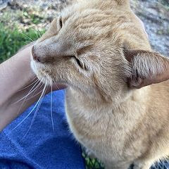
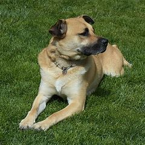
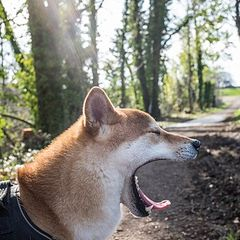
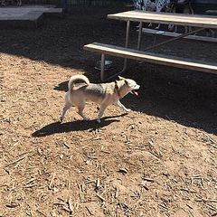
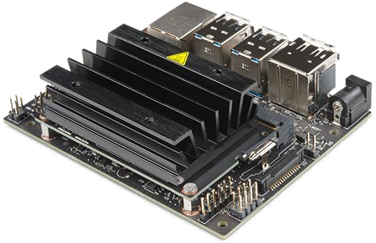

---
hide:
  - navigation
  - toc
---

{ .hero-logo }
{ .hero-logo }

# CVBench

### One GPU-enabled container bundling [Keras](https://keras.io/), [TensorFlow](https://www.tensorflow.org/), [JupyterLab](https://jupyterlab.readthedocs.io/), and a WebUI for computer vision work.

No more stitching together a training script, a notebook, an experiment
tracker, and a deployment story by hand. CVBench packages all of it into one
container, so you can train, evaluate, predict, track, and deploy computer
vision models — and focus on the problem instead of managing an ML
environment.

[Get started](getting-started/quickstart.md){ .md-button .md-button--primary }
[View on GitHub](https://github.com/mmgalushka/cvbench){ .md-button }

-   :material-brain:{ .lg .middle } [**Train**](training/basics.md)

    ---

    Train classification and detection models with augmentation,
    optimizer/loss options, and two-phase fine-tuning built in.

-   :material-chart-box-outline:{ .lg .middle } [**Evaluate**](evaluation/evaluate.md)

    ---

    Score any run on its held-out test split — per-class metrics, confusion
    matrices, and detection outcome tables.

-   :material-target:{ .lg .middle } [**Predict**](evaluation/predict.md)

    ---

    Run inference on new images with a trained experiment, from the CLI or
    the WebUI.

-   :material-package-variant-closed:{ .lg .middle } [**Deploy**](deployment/export.md)

    ---

    Export a trained model to [TFLite](https://ai.google.dev/edge/litert), [ONNX](https://onnx.ai/), or a [Hailo](https://hailo.ai/) HEF package, or get
    step-by-step Jetson deployment instructions — all from one command.

-   :material-history:{ .lg .middle } [**Explore**](tools/experiment-tracker.md)

    ---

    Every run is recorded automatically — browse, compare, and revisit past
    experiments at any time.

-   :material-notebook-outline:{ .lg .middle } [**Customize**](tools/jupyter-notebook.md)

    ---

    Need something the CLI doesn't cover? JupyterLab is right there in the
    same container for custom, one-off experimental work.

## From zero to a model on your device

No training script. No notebook. No glue code. <b>Six steps, one sandbox, zero lines of code.</b>

1

<h3><a href="getting-started/installation/">Deploy the sandbox</a></h3>
One container bundles Keras, TensorFlow, JupyterLab and the WebUI.

$ docker run -d --gpus all \ &nbsp;&nbsp;-p&nbsp;8000:8000&nbsp;-p&nbsp;8888:8888&nbsp;\ &nbsp;&nbsp;mmgalushka/cvbench:latest

DockerGPU:8000 WebUI:8888 Jupyter

2

<h3><a href="data/prepare/">Get a dataset</a></h3>
Grab a cats-vs-dogs folder and split it into train / val / test.

$ curl -LO &lt;your-dataset-url&gt;/cats_dogs.zip $ unzip cats_dogs.zip -d data/pool $ data split data/pool data/cats_dogs $ data list

<figure class="tile cat"><figcaption>cat</figcaption></figure><figure class="tile cat"><figcaption>cat</figcaption></figure><figure class="tile cat"><figcaption>cat</figcaption></figure><figure class="tile dog"><figcaption>dog</figcaption></figure><figure class="tile dog"><figcaption>dog</figcaption></figure><figure class="tile dog"><figcaption>dog</figcaption></figure>

train 80%val 10%test 10%

3

<h3><a href="training/basics/">Train</a></h3>
Point at the data folder; CVBench handles augmentation, loss and tracking.

$ train data/cats_dogs --epochs 10 … epoch 10/10  acc 0.97  val_acc 0.95 # prints the run name when it finishes

<svg viewBox="0 0 240 120" role="img" aria-label="Training accuracy rising and loss falling over 10 epochs">
<g stroke="var(--md-default-fg-color--lightest)" stroke-width="1"><path d="M28 10H232M28 40H232M28 70H232M28 100H232"/></g>
<path d="M28 88C70 50 110 30 150 22S210 14 232 12" fill="none" stroke="var(--cv-ok)" stroke-width="2.5"/>
<path d="M28 20C70 60 110 84 150 92S210 98 232 98" fill="none" stroke="var(--md-primary-fg-color)" stroke-width="2.5"/>
<circle cx="232" cy="12" r="4" fill="var(--cv-ok)"/><circle cx="232" cy="98" r="4" fill="var(--md-primary-fg-color)"/>
<g font-size="10" font-family="monospace" fill="var(--md-default-fg-color--light)"><text x="30" y="116">epoch 1</text><text x="200" y="116">10</text></g>
<text x="140" y="10" font-size="10" font-family="monospace" fill="var(--cv-ok)">accuracy</text><text x="140" y="84" font-size="10" font-family="monospace" fill="var(--md-primary-fg-color)">loss</text></svg>

4

<h3><a href="evaluation/evaluate/">Evaluate</a></h3>
Score on the held-out test split, then explore results in the WebUI.

$ evaluate &lt;run-name&gt; $ serve --host 0.0.0.0 --port 8000

pred cat

pred dog

cat

48

2

dog

3

47

5

<h3><a href="deployment/export/">Export for your target</a></h3>
One command; pick the format your hardware speaks.

$ runs export &lt;run-name&gt; --format plan

TFLiteONNXHailo HEFJetson

6

<h3><a href="deployment/jetson/">Run it on the device</a></h3>
Copy the ONNX model to the Jetson and build the TensorRT engine with the printed steps.

$ scp .../export/plan/model.onnx user@jetson:~ $ trtexec --onnx=model.onnx --saveEngine=model.plan

<figure class="device"><figcaption>Jetson Nano · cat 0.98</figcaption></figure>

<strong>Zero lines of code.</strong> Every step above ran inside one sandbox from the CLI or WebUI. Need something custom? <a href="tools/jupyter-notebook/">JupyterLab</a> is right there in the same container.

Full CLI reference and guides: use the navigation above, or run `commands`
inside the container for the complete picture.

